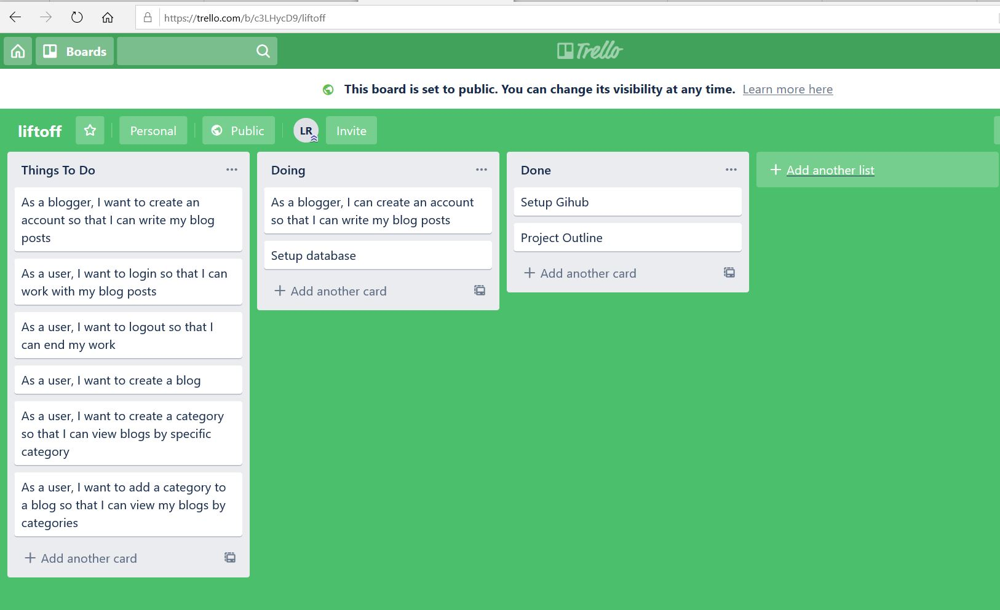

# Project Planning
For this assignment, you'll create some initial plans for your project.

## Assignment Description
[Project Planning Assignment](https://education.launchcode.org/liftoff/modules/assignments/project-planning)

## Submission Instructions

### Wireframes

- [User Signup](./UserSignup.JPG)
- [User Login](./UserLogin.JPG)
- [Create Category](./UserCreateCategory.JPG)
- [Create Blog](./UserCreateBlog.JPG)
- [View All Blog Posts](./UserBlogs.JPG)

### Project Tracker

[Trello Tracker Link](https://trello.com/b/c3LHycD9/liftoff)

### Project Repo Link

[Github LienRyan blog-liftoff project](https://github.com/lienryan/blog-liftoff.git)
